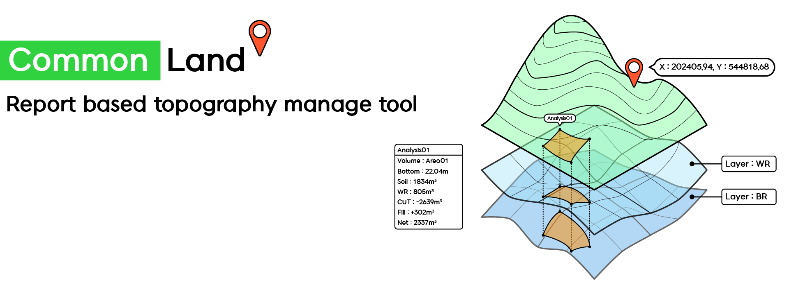

# Common Land (UNDER CONSTRUCTION)

Tool for create topography, manage land based on borehole report.

---

## Introduction

### Main Feature
- Borehole data editor
- Visualize Borehole and create topography

### Main tech stacks
- Electorn, React, SQLite, Threejs, Zustand

---

### Current Version (0.0.1)
- The simple guide to use for this application is posted at :  
  https://cheddar-napkin-4cc.notion.site/CommonLand-25-03-24-0-0-1-KR-1bfa42ff6f228083b612d4644b16003d?pvs=74
- Now it's written in Korean. Soon, I'll translate it as other languages (ENG, JPN)

---

## For developers (Underconstruction)
